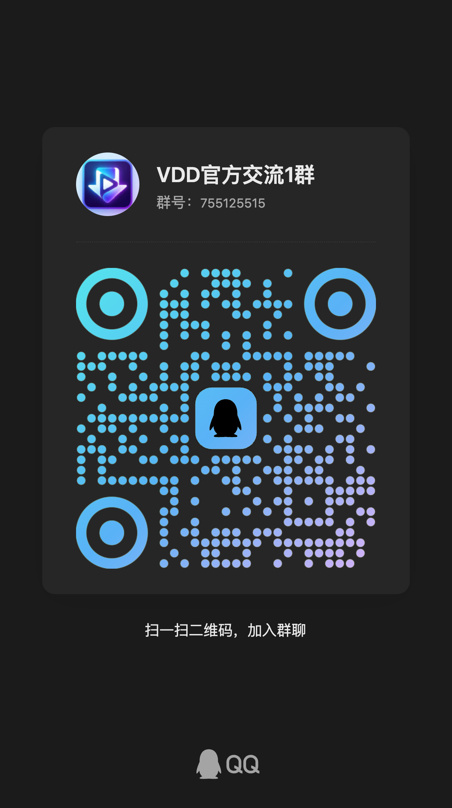
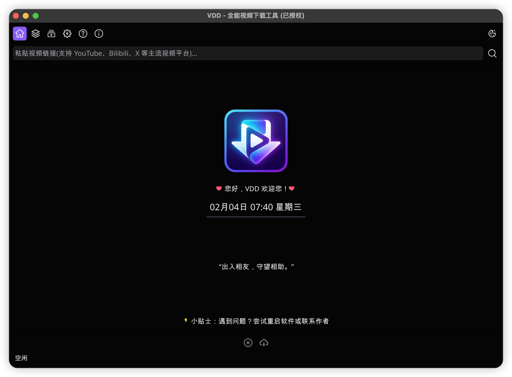
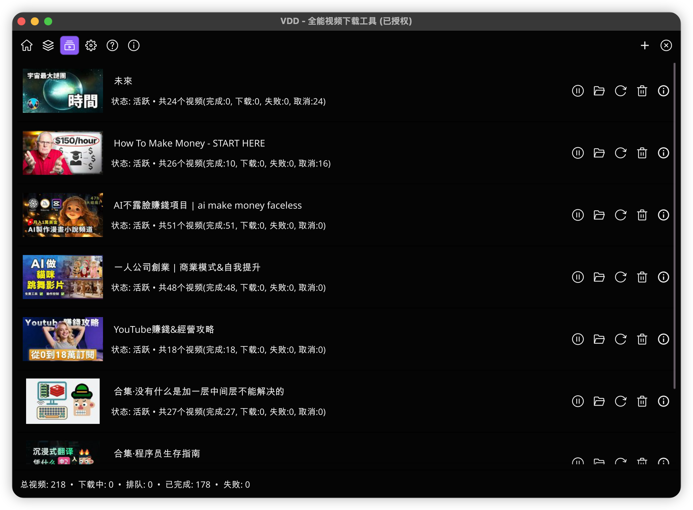

# VDD - Video Downloader

**VDD** 是一个高效、跨平台的视频下载工具，基于强大的 `yt-dlp` 内核构建。支持 YouTube、Bilibili、TikTok、Twitter (X)、Facebook 等全球主流视频平台。

## 主要特性

- **多平台支持**：完美运行于 Windows、macOS 和 Linux。
- **多站点解析**：支持 1000+ 视频网站（涵盖所有主流平台）。
- **画质选择**：支持 8K、4K、2K、1080P 等多种画质及音质选择。
- **自动下载**：可配置自动下载推荐的最佳画质。
- **隐私模式**：支持配置代理和 Cookie，轻松访问受限内容。
- **暗黑模式**：内置多种主题风格，自动适应系统。
- **订阅模式**：v1.4新增，支持批量订阅up主的视频列表。

## 版本说明

为了方便不同的用户，本软件分为精简版和完整版，两者功能相同，只是为了减小体积的大小，精简版不会依赖的第三方工具，如 ffmpeg 等，此时需要自行安装（通常对于高级用户）。

如果你不知道ffmpeg，直接下载使用完整版即可。

- **精简版 (Lite)**：体积较小，不包含 `ffmpeg`。
  - 适合已有 `ffmpeg` 环境的用户，或仅下载无需合并的单文件视频。
  - 如果下载 1080P+ 高画质视频（通常音画分离），需手动在设置中配置 `ffmpeg` 路径。
- **完整版 (Full)**：推荐使用。已集成 `ffmpeg`。
  - **开箱即用**，自动处理所有格式的音画合并与转码。

## 下载地址

请在右侧 **[Releases]** 页面下载最新版本：

> 注意:
> full 标记的为完整版，lite 标记的为精简版。

### Windows

- [下载 vdd-(版本号)-windows-amd64-(full|lite).zip](https://github.com/hankmor/video-downloader/releases/latest)
- 解压后双击 `vdd.exe` 即可使用。

### macOS

- [下载 vdd-(版本号)-macos-(full|lite)-dmg.zip](https://github.com/hankmor/video-downloader/releases/latest)
- 支持 Intel 和 Apple Silicon (M1/M2/M3)。
- _注意：如果提示“无法验证开发者”，请按住 `Control` 键点击应用图标，选择“打开”。_

### Linux

- [下载 vdd-(版本号)-linux-amd64-(full|lite).tar.xz](https://github.com/hankmor/video-downloader/releases/latest)
- 解压后在终端运行 `./vdd`。

---

## 快速使用

1.  **粘贴链接**：复制视频网址，软件会自动识别（需开启剪贴板监听）。
2.  **点击解析**：获取视频信息。
3.  **选择下载**：点击列表中的“下载”按钮，等待完成。

## 官方文档

VDD 使用飞书来管理文档，详见[这里](https://vdd-club.feishu.cn/wiki/IPIlwLnrTi0Jsgkwl7Rc27UHnle?from=from_copylink)。

有任何问题和建议请直接提交 [issue](https://github.com/hankmor/video-downloader/issues), 或者加入**官方交流群**获得支持:

