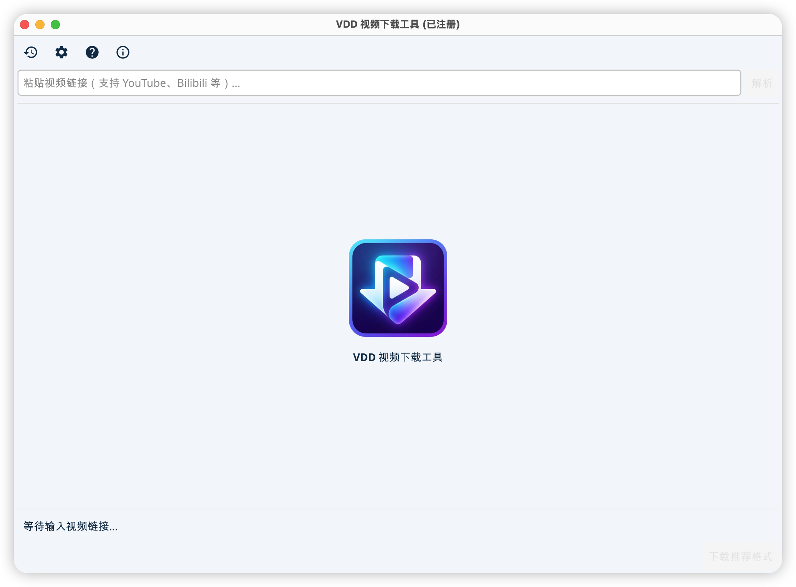

# VDD - Video Downloader

**VDD** 是一个高效、跨平台的视频下载工具，基于强大的 `yt-dlp` 内核构建。支持 YouTube、Bilibili、TikTok、Twitter (X)、Facebook 等全球主流视频平台。

## 主要特性

- **多平台支持**：完美运行于 Windows、macOS 和 Linux。
- **多站点解析**：支持 1000+ 视频网站（涵盖所有主流平台）。
- **画质选择**：支持 4K、2K、1080P 等多种画质及音质选择。
- **自动下载**：可配置自动下载推荐的最佳画质。
- **隐私模式**：支持配置代理和 Cookie，轻松访问受限内容。
- **暗黑模式**：内置科技蓝（Dark/Light）主题，自动适应系统。

## 后续计划

- [ ] 批量下载增强
  - [ ] 批量下载
  - [ ] 播放列表 (Playlist) 解析与下载
  - [ ] 频道 (Channel) 解析与下载
  - [ ] 批量链接一次性导入
- [ ] 音频提取与转换
  - [ ] "仅音频 (MP3)" 模式
  - [ ] 自动转换 m4a/webm 为 mp3
- [ ] 队列管理
  - [ ] 下载队列 (加入队列/开始/暂停/删除)
  - [ ] 并发任务调度优化
- [ ] 浏览器扩展助手
  - [ ] Chrome/Edge 插件开发
  - [ ] 网页嗅探与一键发送到 VDD
- [ ] 国际化 (i18n)
  - [ ] 多语言支持架构
  - [ ] 英文界面翻

## 版本说明

- **精简版 (Lite)**：体积较小，不包含 `ffmpeg`。
  - 适合已有 `ffmpeg` 环境的用户，或仅下载无需合并的单文件视频。
  - 如果下载 1080P+ 高画质视频（通常音画分离），需手动在设置中配置 `ffmpeg` 路径。
- **完整版 (Full)**：推荐使用。已集成 `ffmpeg`。
  - **开箱即用**，自动处理所有格式的音画合并与转码。

## 下载地址

请在右侧 **[Releases]** 页面下载最新版本：

### Windows

- [下载 vdd-windows-amd64.zip](https://github.com/hankmor/video-downloader/releases/latest)
- 解压后双击 `vdd.exe` 即可使用。

### macOS

- [下载 vdd-macos.zip](https://github.com/hankmor/video-downloader/releases/latest)
- 支持 Intel 和 Apple Silicon (M1/M2/M3)。
- _注意：如果提示“无法验证开发者”，请按住 `Control` 键点击应用图标，选择“打开”。_

### Linux

- [下载 vdd-linux-amd64.tar.xz](https://github.com/hankmor/video-downloader/releases/latest)
- 解压后在终端运行 `./vdd`。

---

## 快速使用

1.  **粘贴链接**：复制视频网址，软件会自动识别（需开启剪贴板监听）。
2.  **点击解析**：获取视频信息。
3.  **选择下载**：点击列表中的“下载”按钮，等待完成。

## 常见问题

**Q: 下载失败怎么办？**
A: 请检查网络连接。如果是海外平台（如 YouTube），请在设置中配置代理（例如 `http://127.0.0.1:7890`）。

**Q: 只有声音没有画面？**
A: 请确保下载的是 `Video` 或 `Video+Audio` 格式。
