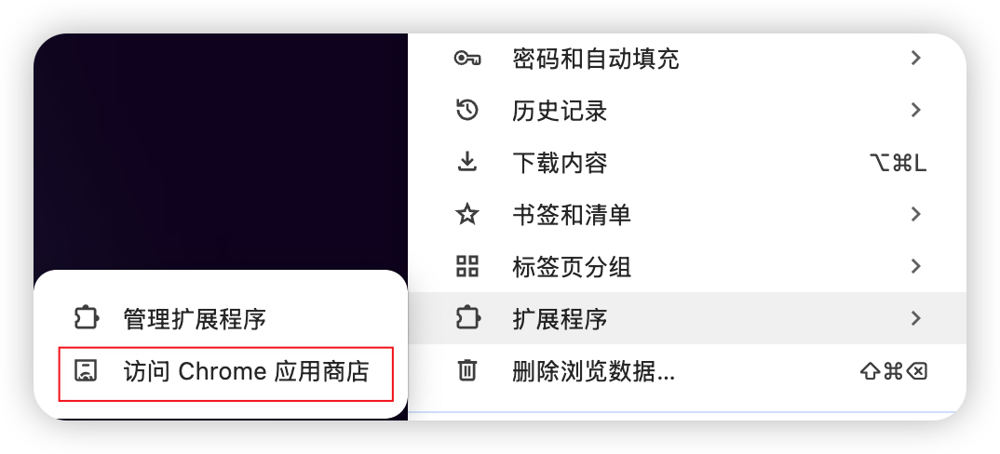
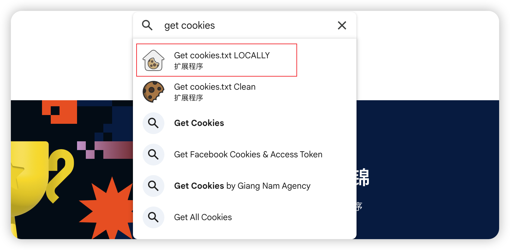
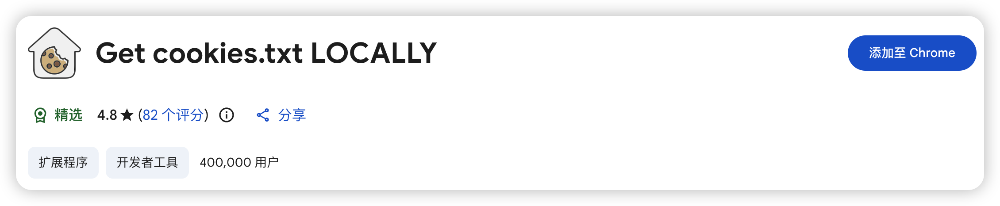
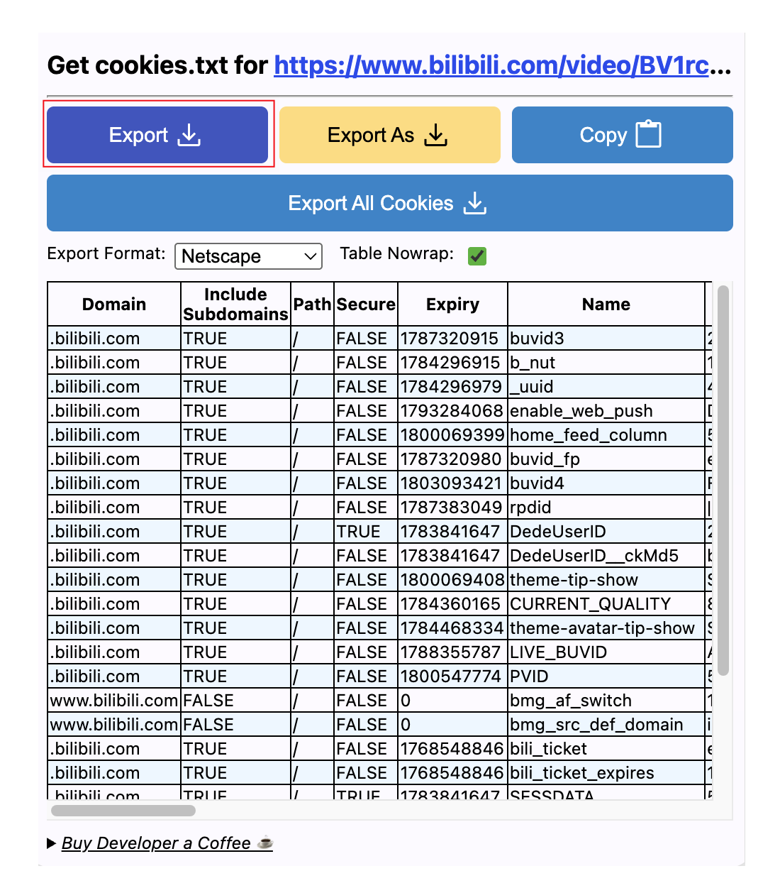
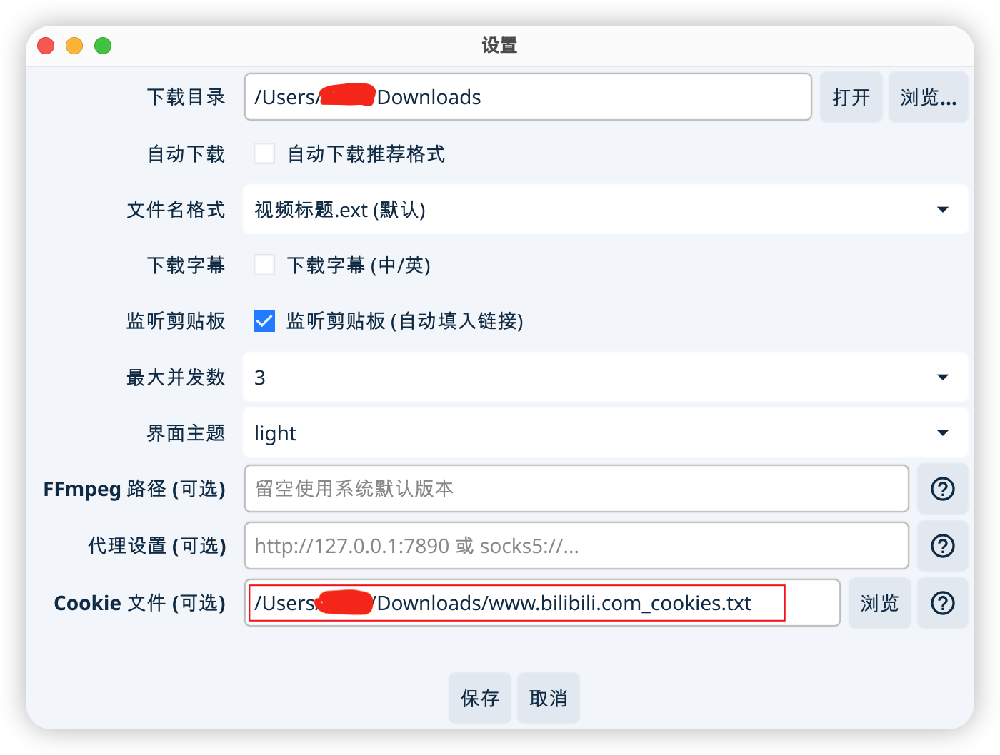

# Cookie 设置指南

这里以 Chrome 浏览器为例， 其他浏览器请自行搜索对应插件。

## 安装 get cookies.txt locally 插件

在打开的页面中，搜索 get cookies.txt locally。

然后点击 添加到 Chrome，等待安装完成。

## 使用插件导出 Netscape 格式的 cookie

安装完成后，访问你想要的视频网站时，点击插件图标，即可看到当前的 cookie 信息，比如我访问的 b 站:

接下来，需要导出，Export Format 选择 `Netscape`，然后点击 `Export` 即可，通常，导出的文件放在下载目录中。

## VDD 中设置 cookie

打开 VDD，点击设置，找到 `Cookie`，然后点击 `浏览`，选择你刚才导出的 cookie 文件, 后缀为 `xxx_cookies.txt`，最后**千万别忘了**点击 `保存`按钮。

