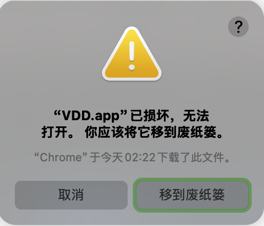
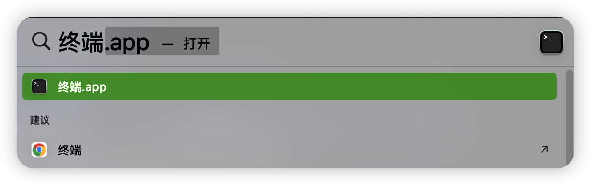
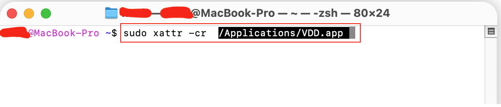

> **🛡️ 安全承诺**
>
> 郑重承诺：本软件**绝对安全无毒**，未包含任何恶意代码。
> 出现的安全提示仅因为开发者未购买高昂的 Apple 企业签名证书（每年 $99），导致 macOS 无法识别开发者身份。但这完全不影响软件的正常使用和安全性，请放心安装。

# macOS 无法打开/提示损坏 解决方案

如果您在 macOS 上打开 VDD 时遇到以下提示：

- “VDD 已损坏，无法打开。您应该将它移到废纸篓。”
- “无法打开 VDD，因为无法验证开发者。”
- “恶意软件保护...”



这是因为 macOS 的安全机制（Gatekeeper）拦截了未签名的应用。请按照以下步骤解决。

---

## 方法一：通过“隐私与安全性”允许（推荐）

1.  当出现错误提示时，点击 **“取消”**。
2.  打开 **系统设置 (System Settings)** -> **隐私与安全性 (Privacy & Security)**。
3.  向下滑动到 **“安全性”** 区域。
4.  您会看到一条提示：“已阻止使用‘VDD’，因为来自身份不明的开发者”。
    
5.  点击右侧的 **“仍要打开 (Open Anyway)”** 按钮。
6.  在弹出的确认框中，输入您的 mac 密码，然后点击 **“打开”**。

如果没有出现“仍要打开”的选项，可以尝试方法二。

---

## 方法二：使用终端命令修复（一劳永逸）

如果方法一无效，或者您看到的是“文件已损坏”的提示，请使用此方法。

1.  打开 **终端 (Terminal)** 应用（在“启动台” -> “其他” 中可以找到, 或者使用 Cmd + 空格键 打开启动台，然后输入“终端”）。



2.  复制以下命令（注意最后有一个空格）：

    ```bash
    sudo xattr -cr
    ```

3.  不要回车。**将 VDD 应用程序图标从 Finder 拖入终端窗口**。

        - 终端会自动填入应用的完整路径，看起来像这样：

        ```bash
        sudo xattr -cr /Applications/VDD.app
        ```

    

4.  按下 **回车键 (Enter)**。
5.  输入您的开机密码（输入时屏幕不会显示密码），然后按回车。
6.  再次尝试打开 VDD，现在应该可以正常运行了。

## 常见问题

**Q: 为什么会有这个提示？**
A: 因为 VDD 是个人开发者作品，为了降低成本没有购买昂贵的 Apple 开发者证书进行签名。这不会影响软件的安全性，请放心使用。

**Q: 为什么提示“已损坏”且设置里没有“仍要打开”按钮？**
A: 当系统检测到应用签名不完整且带有隔离标记时，可能会直接判定为“损坏”而不提供 UI 绕过选项。此时**方法一无效，必须使用方法二（终端命令）**来清除隔离标记。

**Q: 需要每次都这样操作吗？**
A: 不需要。只需要在第一次打开时操作一次，之后就可以像普通软件一样使用了。
