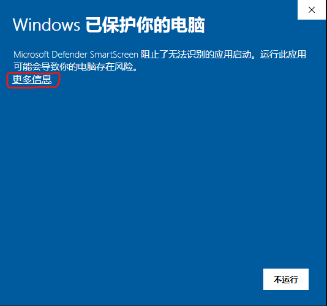
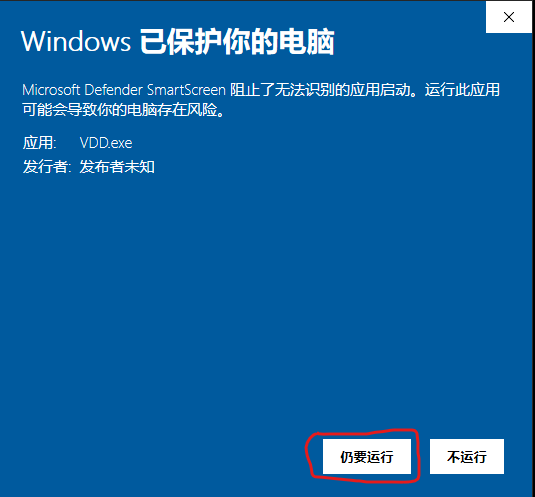

> **🛡️ 安全承诺**
>
> 郑重承诺：本软件**绝对安全无毒**，未包含任何恶意代码, 请放心使用。

# Windows 常见问题

## 启动 VDD 时被系统保护

这是 Windows 的安全机制, 放心放过即可。

点击 "更多信息"，可以看到：

然后点击 “仍要运行” 即可。

## 为什么杀毒软件会提示病毒

因为杀毒软件无法验证开发者身份，属于杀毒软件的误报， 放心放过即可。本软件**绝对安全无毒**，未包含任何恶意代码, 请放心使用。
